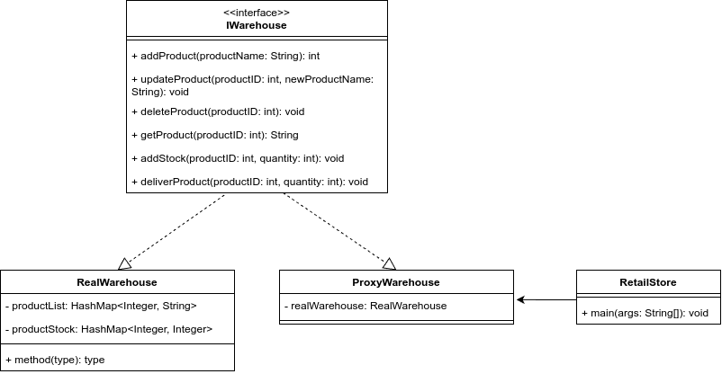

# Lab Assignment 5: Write a Java program to demonstrate the implementation of a proxy pattern for an online retail store with global distribution and warehousing.

## Class Diagram

## Structure of the Program

1. `IWarehouse` interface: names all the common methods for different types for warehouse.
1. `RealWarehouse` class: implements the `IWarehouse` interface with functionalities for the warehouse.
1. `ProxyWarehouse` class: implements the `IWarehouse` interface. This class is used to interact with the `RealWarehouse` object indirectly.
1. `RetailStore` class: contains the `main` method and demonstrates the proxy design pattern

## Ouput
The output of the demo program can be found inside <a href="Out.txt">Out.txt</a>